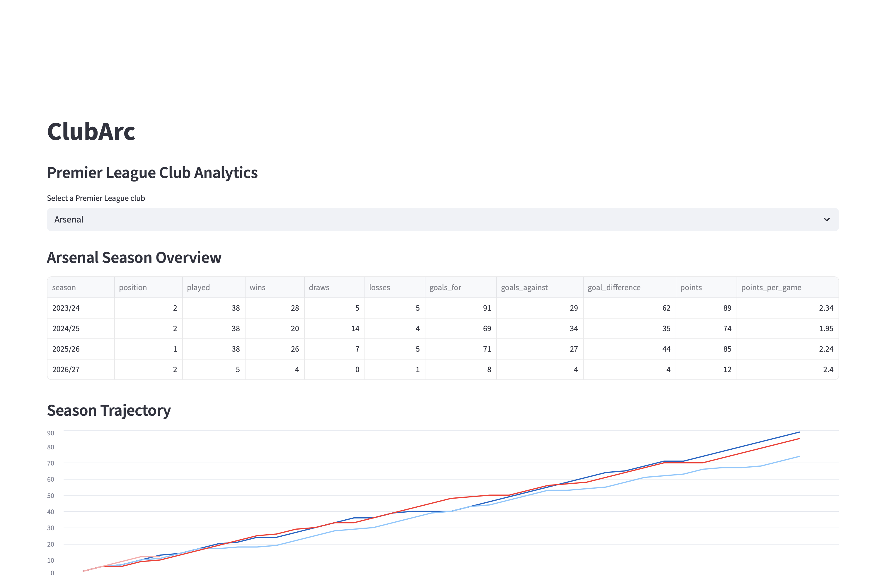
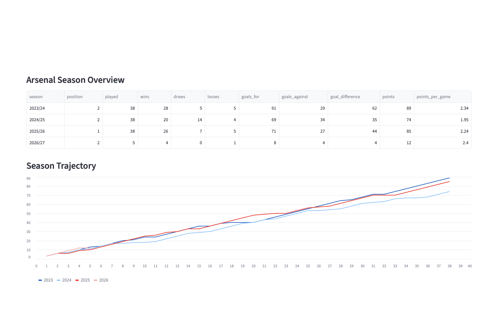

# ClubArc

ClubArc is an end to end data pipeline built for comparing Premier League club performance across multiple seasons. 

**Live application:** [clubarc.streamlit.app](https://clubarc.streamlit.app)

**GitHub repository:** [github.com/KaiPilgrim/clubarc](https://github.com/KaiPilgrim/clubarc)


---

## What I built and who for

ClubArc is a web app that displays Premier League data across the seasons beginning in 2023, 2024, 2025 and 2026. Where ClubArc differs from many football statistics websites is that it provides a detailed view of a team's performance across multiple seasons in one place. It is designed for football fans who enjoy using statistics and data to compare Premier League clubs without having to rely on memory for historical performance.

A second function of ClubArc is to compare how a club was performing at the same stage of different seasons. The user can choose a number of completed matches and see how a team performed after five matches across four seasons which can include the current season.

The application allows a user to select a Premier League club and:

- view its season level performance across multiple seasons
- compare cumulative points trajectories
- compare seasons after the same number of completed matches
- see the current season alongside completed historical seasons

The main question ClubArc was designed around was:

> **How is this club performing compared with recent seasons at the same point in the campaign?**

Rather than trying to recreate a complete football statistics website, the application was deliberately focused on making this comparison simple.



---

## The data

ClubArc uses the **Football-Data.org v4 API**.

- **Football-Data.org:** [football-data.org](https://www.football-data.org)
- **API documentation:** [Football-Data.org v4 documentation](https://docs.football-data.org/general/v4/index.html)
- **Terms and Conditions:** [Football-Data.org Terms and Conditions](https://www.football-data.org/about)

The project extracts Premier League data from two API endpoints:

- **Matches:** `https://api.football-data.org/v4/competitions/PL/matches`
- **Standings:** `https://api.football-data.org/v4/competitions/PL/standings`

A `season` parameter is used to retrieve data for the required season.

The project currently contains data for seasons beginning in:

- 2023
- 2024
- 2025
- 2026

### Match data

Match data is the main source used to build the analytical model.

The pipeline extracts information including:

- match ID
- season
- date
- matchday
- match status
- home team
- away team
- home goals
- away goals

Only completed matches are used when calculating results, points and season progress.

### Standings data

Standings data is deliberately kept separate from the main transformation process.

Instead of using the published standings to create ClubArc's season statistics, the pipeline calculates those statistics from individual match results.

The API standings are then used as independent reference data to check whether those calculations are correct.

### Raw data

Raw API responses are saved unchanged as JSON files in `data/raw` before any transformation takes place.

This means the rest of the pipeline can be reproduced from the repository without requiring another user to have any API credentials.

### API authentication and usage

Football-Data.org requires an API token for authenticated requests.

The token is loaded from an environment variable:

```text
FOOTBALL_DATA_API_KEY
```

The API key is not stored in the repository or committed to Git history.

The application includes the required attribution:

> Football data provided by the Football-Data.org API

---

## How it works

ClubArc separates extraction, loading, transformation, validation and presentation so that each stage of the pipeline has a clear responsibility.

The overall flow is:

```text
Football-Data.org API
        |
        v
   Raw JSON files
        |
        v
      DuckDB
        |
        v
 SQL transformations
        |
        v
 Validation against
 API standings data
        |
        v
 Streamlit application
```

### 1. Extract — `src/extract.py`

`extract.py` retrieves Premier League match and standings data from the API for each selected season.

The API responses are written directly to `data/raw` as JSON files before any transformation takes place.

The two sources are deliberately kept for different purposes:

- match data feeds the main transformation pipeline
- standings data is reserved for validation

Extraction is kept separate from the normal reproducible run because accessing the API requires a private API key.

---

### 2. Load — `src/load.py`

`load.py` reads the committed match JSON files and creates the base `matches` table in DuckDB.

Only the fields required for the project are selected from the larger API response.

The `matches` table contains:

- `match_id`
- `season_start_year`
- `season_id`
- `utc_date`
- `status`
- `matchday`
- `home_team_id`
- `home_team_name`
- `away_team_id`
- `away_team_name`
- `home_goals`
- `away_goals`

Explicit database types are used and `match_id` is defined as the primary key.

The table is created using `CREATE OR REPLACE TABLE` so rerunning the load stage rebuilds it rather than continually producing duplicate records.

---

### 3. Transform — `src/transform.py`

`transform.py` runs the SQL transformation files in sequence:

```text
01_team_match_results.sql
        |
        v
02_team_season_summary.sql
        |
        v
03_team_season_progress.sql
```

#### `01_team_match_results.sql`

The raw `matches` table contains one row for each football match.

For club level analysis, each match is represented from either team's perspective.

This transformation therefore converts each completed match into two team records:

- one from the home team's perspective
- one from the away team's perspective

For each team it derives:

- opponent
- venue (Home or Away)
- goals for
- goals against
- win, draw or loss
- points earned
- chronological club match number

This creates the base team view used by the later transformations.

#### `02_team_season_summary.sql`

This view aggregates the team's match records into a season wide performance.

It calculates:

- matches played
- wins
- draws
- losses
- goals for
- goals against
- goal difference
- total points
- home points
- away points
- points per game
- league position

Teams are ranked by points, followed by goal difference and then goals scored in accordance to the Premier Leagues own tie breaking rules.



#### `03_team_season_progress.sql`

The season summary shows the overall result of a campaign but ClubArc also needs to compare clubs at the same stage of different seasons.

This view therefore uses SQL functions to calculate cumulative performance after every completed match.

It calculates:

- cumulative wins
- cumulative draws
- cumulative losses
- cumulative goals for
- cumulative goals against
- cumulative goal difference
- cumulative points
- cumulative points per game

These calculations power the season trajectory chart and same stage comparison in the application.

---

### 4. Validate — `src/validate.py`

In order to not assume that the statistics calculated from the match data were correct simply because the pipeline completed successfully, the raw standings responses were loaded into a separate `standings_reference` table.

`04_validate_team_season_summary.sql` compares the season statistics calculated by ClubArc against the reference standings returned by the API.

The following fields are checked individually:

- matches played
- wins
- draws
- losses
- goals for
- goals against
- goal difference
- points
- league position

Each field produces a Boolean comparison.

A team's record is marked as valid only when every checked metric matches the reference standings.

`validate.py` then reports the total number of mismatched records.

This means the standings data acts as an independent check on the transformation logic rather than being used to create the analytical results themselves.

---

### 5. Present — `app/app.py`

The final transformed data is used by a Streamlit web application.

A user selects a Premier League club and can explore three main outputs.

#### Season overview

The season overview displays the club's performance across all available seasons.

This makes it possible to compare final league position, wins, draws, losses, goals, points and points per game in one view.

#### Season trajectory

The trajectory chart plots cumulative points after each completed match.

This makes it easier to see how quickly or slowly a team's season developed compared with previous campaigns.

#### Same stage comparison

A slider allows the user to select a number of completed matches.

ClubArc then returns each season's performance at exactly that point in the campaign.

For example, if the current season has five completed matches, the user can compare those first five matches with the first five matches from each previous season.

This avoids comparing a partially completed current season with the final totals from historical seasons.

This was the main use case I wanted ClubArc to solve.

---

### Reproducibility

The reproducible part of the pipeline is designed so that rerunning it from the same raw data does not continually create duplicate records.

The `matches` table and validation reference table are recreated during their respective stages.

The analytical transformations use `CREATE OR REPLACE VIEW`.

As a result, rerunning:

```text
load -> transform -> validate
```

from the same raw input rebuilds the same database state rather than adding another copy of the existing data.

Extraction behaves differently because the API can change, particularly during an active Premier League season.

Running `extract.py` again replaces the existing raw JSON files for the selected seasons with the responses returned by the API at that time.

---

### What would need to change at a larger scale

ClubArc is intentionally a small local data pipeline.

For the current amount of data, DuckDB allows the complete pipeline and analytical model to remain lightweight and reproducible inside the project.

At a larger scale possible changes would include:

- separating raw data storage from the application environment
- loading only new or changed records instead of rebuilding the full dataset
- scheduling API ingestion when new matches are completed
- adding robust automated data quality tests
- dynamically identifying the current season
- moving to infrastructure designed for multiple concurrent application users if required

For this project the preferred logic was to keep the architecture small and understandable rather than introduce infrastructure that the current use case did not require.

---

## How to run it

The repository contains the raw API responses required to reproduce the main pipeline, so an API key is **not required for the normal run**.

### 1. Clone the repository

```bash
git clone https://github.com/KaiPilgrim/clubarc.git
cd clubarc
```

### 2. Create a virtual environment

```bash
python -m venv .venv
```

Activate it on macOS or Linux:

```bash
source .venv/bin/activate
```

On Windows:

```bash
.venv\Scripts\activate
```

### 3. Install the dependencies

```bash
pip install -r requirements.txt
```

### 4. Run the pipeline and application

```bash
python src/run.py
```

`run.py`:

1. loads the committed raw match data into DuckDB
2. runs the SQL transformations
3. validates the derived season summaries
4. launches the Streamlit application

The extraction stage is deliberately excluded from `run.py` because it requires an API key.

### Optional: refresh the raw API data

To retrieve the data again from Football-Data.org, create a `.env` file in the project root containing:

```text
FOOTBALL_DATA_API_KEY=your_api_key
```

Then run:

```bash
python src/extract.py
```

After refreshing the raw data, run:

```bash
python src/run.py
```

to rebuild the database, transformations and application from the new responses.

---

## What I would do next

The current version of ClubArc focuses on proving the end to end pipeline and solving the core same stage season comparison use case.

With more time ClubArc could be extended in several areas.

### Dynamically identify the current season

The current application explicitly identifies the 2026 season when determining how many matches have been completed.

ClubArc could instead identify the latest available season directly from the data.

This would allow ClubArc to continue working when a new Premier League season begins without requiring the application code to be changed manually.


### Automate data refreshes

The extraction stage is currently run manually.

A scheduled process could be put in place that checks for newly completed matches and refreshes the raw data automatically.

At a larger scale ClubArc could also move towards an incremental design so that only new or changed data needs to be processed.

### Expand the comparisons

Additional comparisons could include:

- home versus away performance
- goals scored trajectories
- goals conceded trajectories
- recent form
- opponent level comparisons
- league position over time
- user selected seasons
- user selected comparison metrics

ClubArc could keep these additions centred on the original aim of helping football fans quickly understand how a current campaign compares with previous ones in a single view.

### Strengthen testing and monitoring

The current validation stage compares the derived season summary against the API standings.

This could be extended with automated tests for:

- duplicate records
- missing values
- unexpected API responses
- incomplete or postponed fixtures

ClubArc could also add clearer logging so failures can be identified more easily if the pipeline were automated.

### Improve the application experience

The Streamlit interface is deliberately simple because the data pipeline and data model were the main priorities for this project.

With more time the presentation could be improved with clearer chart labels and formatting, while giving users more control over the seasons and metrics they want to compare.

---

## Where AI helped

AI was used throughout this project as a learning, development and review tool rather than a replacement for my own understanding and decision making.

It helped me:

- discuss and refine the structure of the data pipeline.
- understand unfamiliar concepts when working with Streamlit and DuckDB.
- Review Python and SQL code for potential improvements.
- troubleshoot implementation and deployment issues.
- explore different application frameworks, ultimately leading me to choose Streamlit.
- organise the project structure and identify redundant or repetitive code.

As this project involved working with libraries and tools I had limited experience with, AI helped bridge gaps in my knowledge. I used it alongside official documentation to understand how to integrate my ideas into the application rather than simply implementing suggested solutions without understanding them.

My previous experience with Python, SQL and data projects allowed me to approach the development independently. However, certain tasks particularly structuring more complex SQL scripts and organising the codebase I benefited from additional guidance.

Not every AI suggestion was adopted. I reviewed recommendations, questioned their suitability and made the final implementation decisions myself. AI played a more significant role in developing the Streamlit application with Claude generating much of the web application’s initial structure and interface.

One of my key takeaways from this project is that AI is most valuable when supported by foundational knowledge. It's outputs are not always correct or appropriate and without an understanding of the underlying concepts it becomes difficult to maintain control over what is being built.

Ultimately AI helped me learn unfamiliar tools, improve the organisation of my code and approach problems from different perspectives while retaining ownership of the project's direction and implementation.